# Food Delivery Analysis

A production-style data analyst project that combines Python data preparation with Tableau dashboard storytelling.

## Why This Project

This repository demonstrates an end-to-end analytics workflow:
- clean and transform raw order-history data
- build KPI-ready aggregate tables for BI
- design worksheet-level and executive dashboard-level insights in Tableau

The result is a portfolio-ready project suitable for analyst interviews and hiring assessments.

## Project Highlights

- 21K+ food-delivery orders analyzed
- modular Python pipeline organized by responsibility
- 12 Tableau worksheets
- 4 Tableau dashboards
- reusable processed datasets for Power BI or Tableau

## Repository Structure

- [data/raw](data/raw): raw dataset
- [data/processed](data/processed): cleaned and aggregated outputs used in BI
- [src/food_delivery_analysis](src/food_delivery_analysis): modular Python package
- [scripts](scripts): runnable entry script for data build
- [tableau/workbook](tableau/workbook): Tableau workbook file
- [output/tableau/worksheets](output/tableau/worksheets): worksheet snapshots
- [output/tableau/dashboards](output/tableau/dashboards): dashboard snapshots
- [notebooks](notebooks): exploratory and analysis notebook
- [docs](docs): compact project documentation

## Tech Stack

- Python (Pandas)
- Tableau Public / Tableau Desktop

## Quick Start

### 1. Install dependencies

```bash
pip install -r requirements.txt
```

### 2. Build processed datasets

```bash
python scripts/build_tableau_data.py
```

Generated files:
- [data/processed/tableau_main_data_clean.csv](data/processed/tableau_main_data_clean.csv)
- [data/processed/tableau_executive_summary_clean.csv](data/processed/tableau_executive_summary_clean.csv)
- [data/processed/tableau_restaurant_performance_clean.csv](data/processed/tableau_restaurant_performance_clean.csv)
- [data/processed/tableau_customer_experience_clean.csv](data/processed/tableau_customer_experience_clean.csv)
- [data/processed/tableau_geographic_intelligence_clean.csv](data/processed/tableau_geographic_intelligence_clean.csv)

## Tableau Assets

Workbook:
- [tableau/workbook/food.twb](tableau/workbook/food.twb)

Export guide:
- [output/tableau/EXPORT_GUIDE.md](output/tableau/EXPORT_GUIDE.md)

## Dashboard Snapshots

### Dashboard 1: Executive Overview
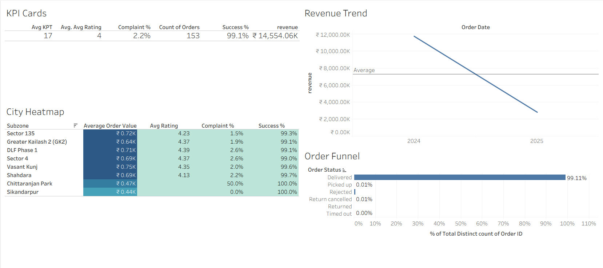

### Dashboard 2: Restaurant and Revenue Performance
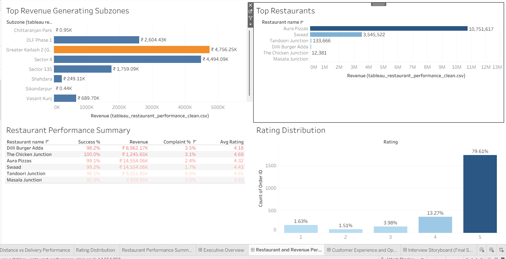

### Dashboard 3: Customer Experience and Operations
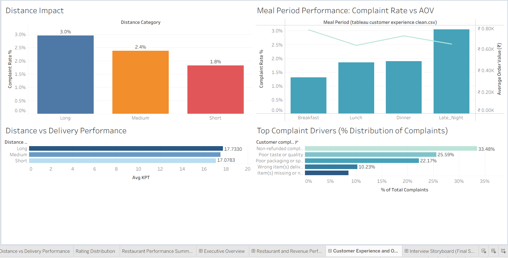

### Dashboard 4: Interview Storyboard
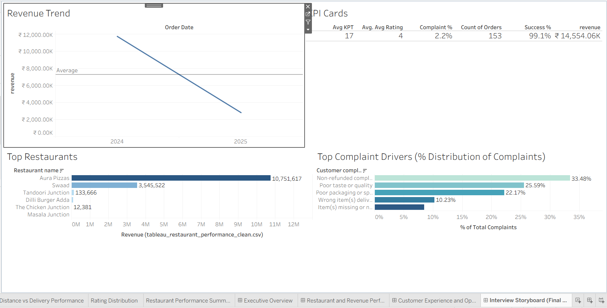

## Worksheet Snapshots

### 01 KPI Cards
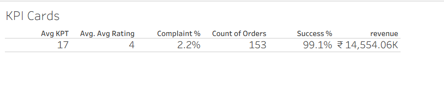

### 02 Revenue Trend
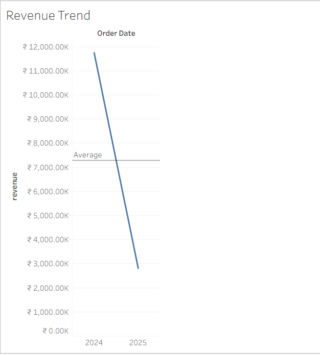

### 03 Order Funnel
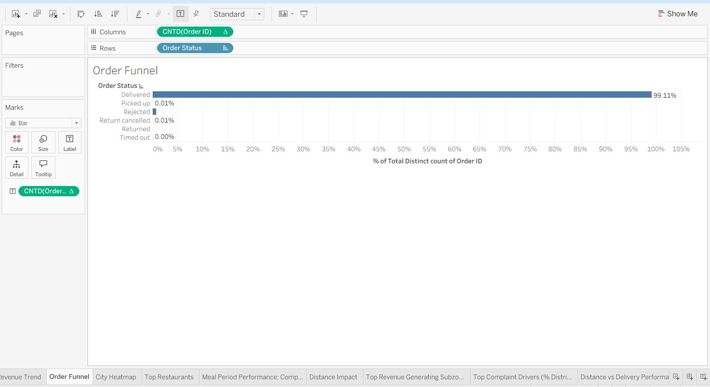

### 04 City Heatmap
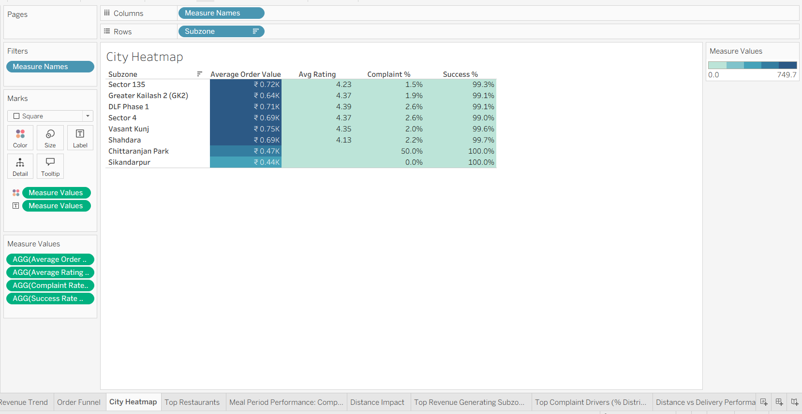

### 05 Top Restaurants
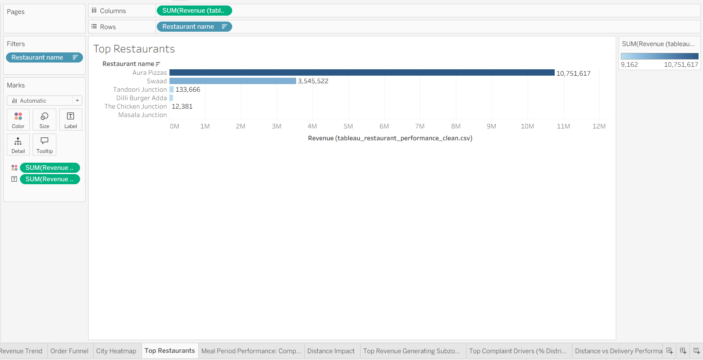

### 06 Meal Period Performance Complaint Rate vs AOV
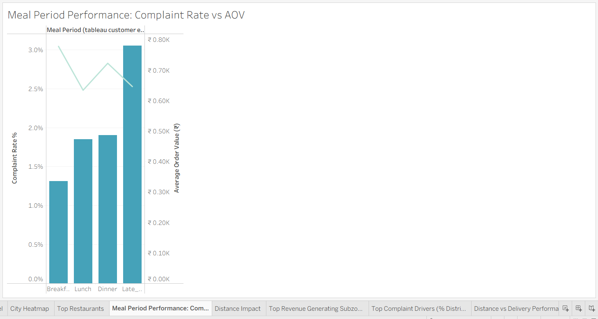

### 07 Distance Impact
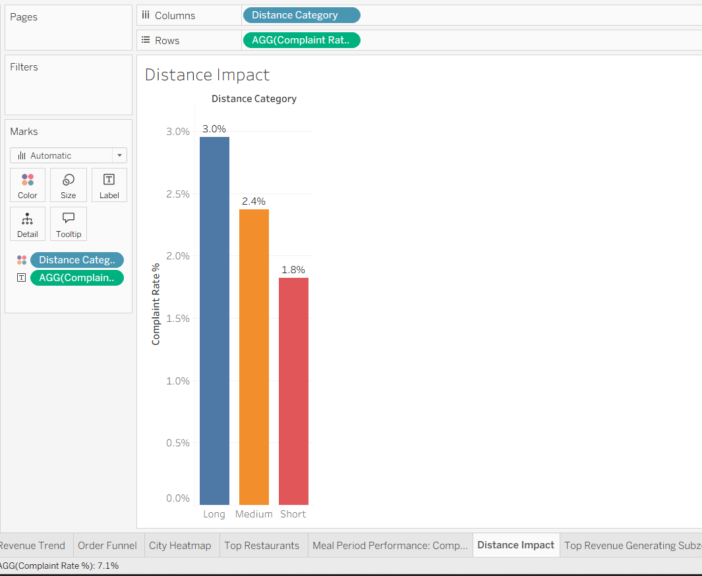

### 08 Top Revenue Generating Subzones
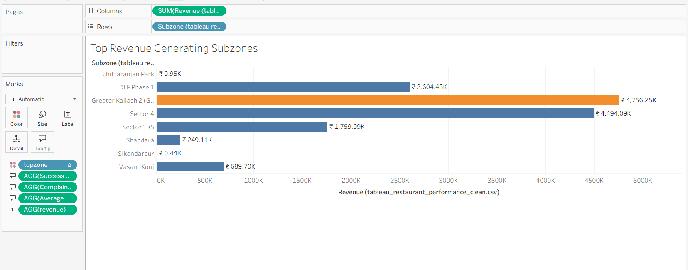

### 09 Top Complaint Drivers Distribution
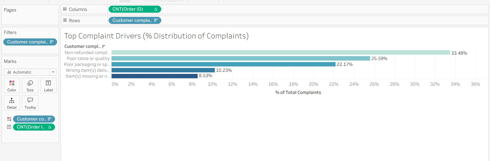

### 10 Distance vs Delivery Performance
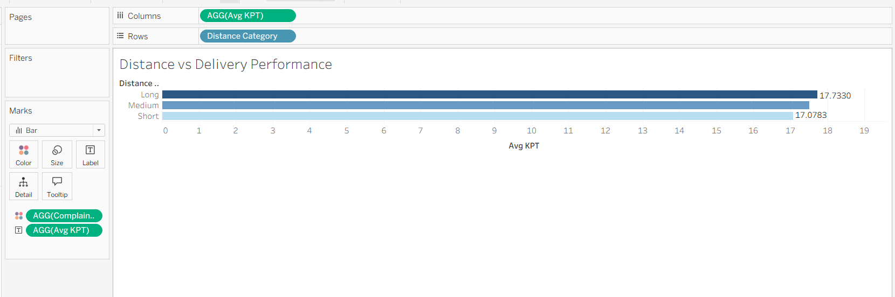

### 11 Rating Distribution
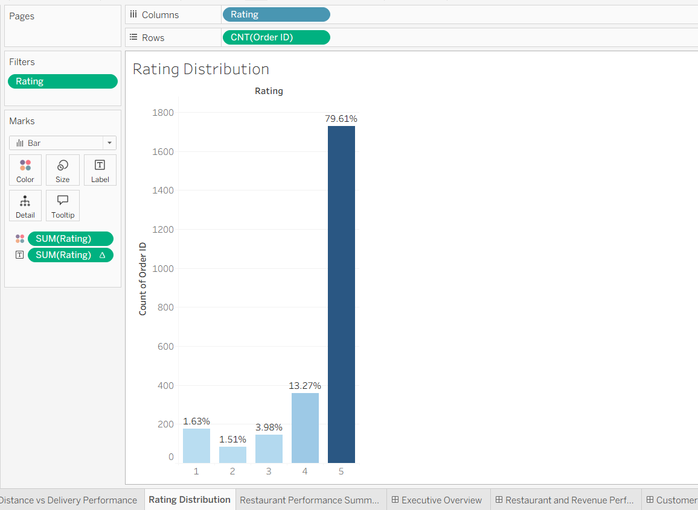

### 12 Restaurant Performance Summary
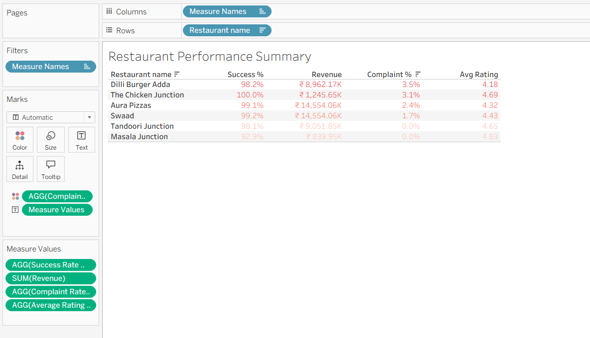

## Dashboard Mapping

- [docs/dashboard_structure.md](docs/dashboard_structure.md)

## Notes

This repository intentionally keeps only project-relevant assets and avoids redundant intermediate files so that both technical and non-technical viewers can navigate it quickly.
